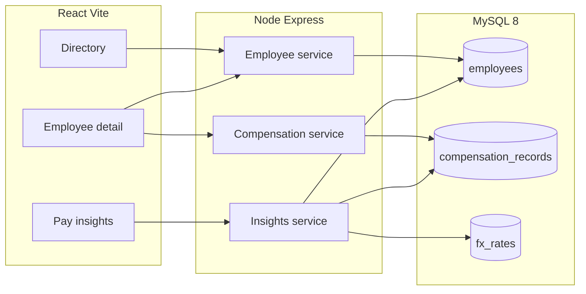

# System design — ACME Salary Management

## 1. Problem recap

HR currently tracks ~10k salaries in Excel across countries. We build a single web app: maintain records and answer pay questions. Stack : **JavaScript, React, Node.js, MySQL**.

## 2. Architecture

```
React (Vite)  →  REST JSON  →  Node.js / Express  →  MySQL 8
                                      │
                                      ├── employees
                                      ├── compensation_records
                                      └── fx_rates
```

One API process, one database, one HR user. 10,000 rows is not a distributed-systems problem. Microservices, Redis, Elasticsearch, and a warehouse are out.



**Why MySQL, not MongoDB:** compensation is a system of record. We need unique employee codes, foreign keys, transactions (raise = close old row + insert new), and indexed `GROUP BY` for insights. Document storage would push joins and invariants into application code.

## 3. Repository layout (from Phase 2)

```
backend/     Express, Prisma, services, tests, seed
frontend/     Vite + React
docs/         Design, AI usage, notes
REQUIREMENTS.md
```

## 4. Domain model

### employees
Who they are: `employee_code` (unique), `full_name`, `email`, `department`, `job_title`, `country` (ISO 3166-1 alpha-2), `status` (`active` | `inactive`), `hire_date`.

### compensation_records
How they are paid (append-oriented history): `employee_id`, `annual_base` DECIMAL(14,2), `currency` (ISO 4217), `effective_from`, `effective_to` (NULL = current), optional `notes`.

**Invariant:** at most one current row per employee (`effective_to IS NULL`). A raise runs in a **transaction**: set `effective_to` on the current row, insert the new row.

### fx_rates
Insights only: `from_currency`, `to_currency` (USD), `rate` DECIMAL(18,8), `as_of_date`. Seeded, not live.

## 5. Money and reporting rules

- Persist amounts as MySQL `DECIMAL`, not JavaScript `number`.
- Convert to USD **only** in insights, using seeded FX.
- Median: documented algorithm (window function or tested helper); even/odd cases covered by tests.
- Validate: amount > 0, valid currency, non-overlapping effective dates.
- Insights filter: `status = active` and current compensation only.

## 6. Indexes (10k)

- `employees(employee_code)` unique
- `employees(country)`, `(department)`, `(status)`, name search as appropriate
- `compensation_records(employee_id, effective_to)`

Paginated list + SQL aggregates; never serialize 10k employees to the client.

## 7. HTTP API

| Method | Path | Role |
|---|---|---|
| GET | `/api/employees` | Paginated search/filter |
| GET | `/api/employees/:id` | Detail + current + history |
| POST | `/api/employees` | Create + initial salary |
| PATCH | `/api/employees/:id` | Identity / status |
| POST | `/api/employees/:id/compensation` | New current salary |
| GET | `/api/insights` | Aggregates (`groupBy`, reporting currency) |
| GET | `/api/lookups` | Distinct countries, departments, titles |

Business logic lives in services, not route handlers.

Insights conceptually:

```sql
SELECT e.country,
       COUNT(*) AS headcount,
       SUM(c.annual_base * fx.rate) AS total_usd,
       AVG(c.annual_base * fx.rate) AS avg_usd
FROM employees e
JOIN compensation_records c
  ON c.employee_id = e.id AND c.effective_to IS NULL
JOIN fx_rates fx
  ON fx.from_currency = c.currency AND fx.to_currency = 'USD'
WHERE e.status = 'active'
GROUP BY e.country;
```

## 8. UI (three screens)

1. **Directory** — search, filters, table, add employee  
2. **Employee** — profile, current pay, history, adjust salary  
3. **Insights** — KPI cards (headcount, total USD, avg, median) + breakdown table + one chart  

Empty, loading, and error states. React Query (or equivalent) for server state.

## 9. Auth

Single HR user (env credentials + JWT or session). Production would use SSO; out of MVP.

## 10. Seed

Deterministic Faker (fixed seed): ~8–12 countries, realistic departments, country-typical salary bands, matching currencies. Idempotent. Target: 10,000 employees in well under a minute.

## 11. Tests

Fast and deterministic (Vitest/Jest + test MySQL):

- Unique `employee_code`
- Raise closes previous compensation; no two current rows
- FX rounding
- Median even/odd
- Inactive excluded from insight totals
- Pagination totals

No requirement for a large Playwright suite in MVP.

## 12. Performance

At 10k rows, indexed `GROUP BY` should be milliseconds. If it is not, fix indexes before adding caches. Optional later: timed seed + explain notes in `docs/PERFORMANCE.md`.

## 13. Deploy (last phase)

Order of work: local Docker Compose (MySQL + API + UI) first; public URL (e.g. Railway/Render + MySQL)

## 14. Implementation phases

| Phase | Deliverable | Typical commit |
|---|---|---|
| 1 | This requirements + design + AI notes | docs only |
| 2 | MySQL, Prisma schema, Express health | schema |
| 3 | Seed 10,000 | seed |
| 4 | Employee API + tests | API |
| 5 | Compensation + tests | domain |
| 6 | Insights API + tests | analytics |
| 7 | React directory + detail | UI |
| 8 | Insights UI | UI |
| 9 | Auth, README runbook, deploy notes / host | readiness |

## 15. Trade-offs

| Choice | Alternative | Why this |
|---|---|---|
| Vite + React | Next.js | JD says ReactJS; SPA + separate API is enough |
| Express | NestJS | Less ceremony for a small domain |
| Prisma | Knex / raw mysql2 | Migrations + typed client; SQL still used for insights if needed |
| MySQL | MongoDB | Invariants and aggregates |
| Annual base only | Full compensation components | Fits Excel-replacement MVP |
| Seeded FX | Live rates | Reproducible tests and demos |
